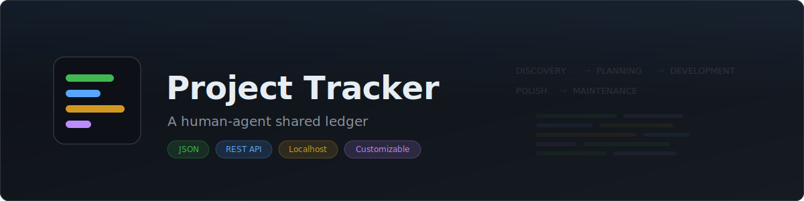
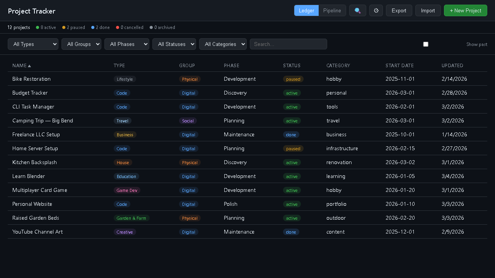
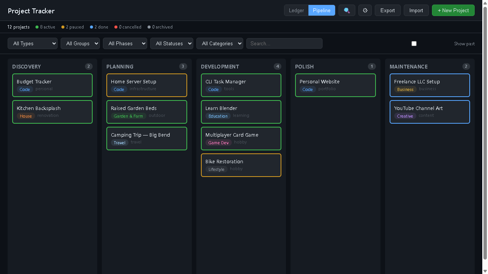
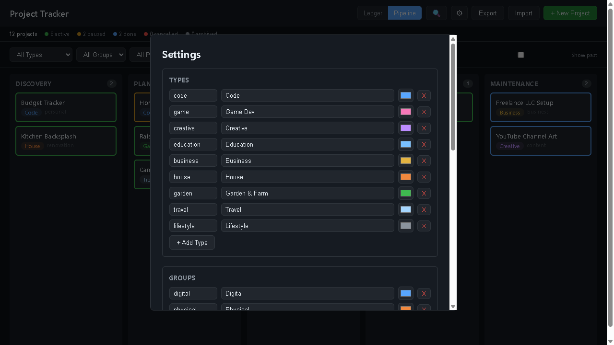
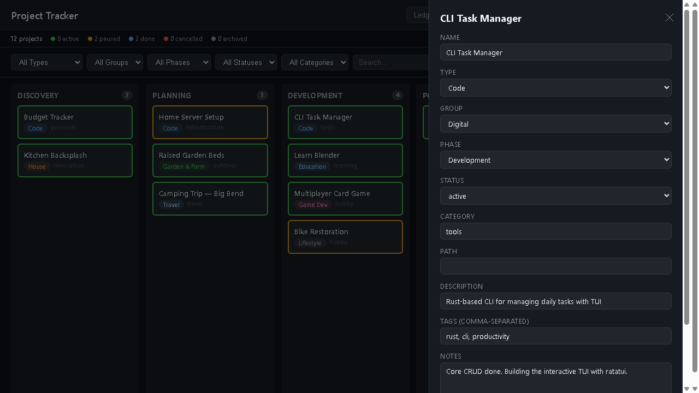

<p align="center">
  
</p>

A single-page dashboard for tracking all your projects. Browser UI for humans, JSON file + REST API for AI coding agents. No database, no auth, no cloud — just a JSON file on your disk that both you and your agents can read and write.

<p align="center">
  
</p>

<p align="center">
  
</p>

## Quick Start

```bash
git clone https://github.com/gitgoodordietrying/project-tracker.git
cd project-tracker
npm install
npm start
# Opens http://localhost:7777
```

Or on Windows, double-click `start.bat`.

On first run, example projects are loaded automatically. Edit or delete them and add your own.

## Features

- **Ledger view** — sortable table with type, phase, status, category, dates
- **Pipeline view** — kanban board with drag-and-drop across phases
- **Filter bar** — filter by type, phase, status, category, or text search
- **Right-click context menu** — quickly change status, move phase, open folder, delete
- **Detail panel** — slide-out editor for all fields including freeform notes
- **Settings UI** — customize types, groups, phases, statuses, and colors from the browser
- **Repo scanner** — scan local directories for git repos and import them as projects
- **Export / Import** — download or upload your projects as JSON
- **Dark theme** — GitHub-inspired design
- **Cross-platform** — works on Windows, macOS, and Linux

## Agent Integration

No protocol, no SDK, no configuration — any agent that can read a file or make an HTTP request works out of the box.

### Direct file access (recommended)

The JSON file is the source of truth. Agents can read and write it directly, even when the server isn't running.

```bash
# Read all projects
cat data/projects.json

# Filter with jq
cat data/projects.json | jq '.projects[] | select(.status == "active")'

# Read valid taxonomy values
cat data/config.json | jq '.types | keys'
```

The server re-reads from disk on every request, so file edits are picked up immediately by the UI.

### REST API (when server is running)

| Method | Endpoint | Description |
|--------|----------|-------------|
| `GET` | `/api/projects` | List all projects |
| `GET` | `/api/projects/:id` | Get one project |
| `POST` | `/api/projects` | Create a project |
| `PUT` | `/api/projects/:id` | Update a project |
| `DELETE` | `/api/projects/:id` | Delete a project |
| `GET` | `/api/config` | Get taxonomy config (types, groups, phases, statuses) |
| `PUT` | `/api/config` | Update taxonomy config |
| `POST` | `/api/scan` | Scan configured paths for git repos |

```bash
# Create a project
curl -X POST http://localhost:7777/api/projects \
  -H "Content-Type: application/json" \
  -d '{"name": "New Project", "type": "code", "phase": "planning"}'

# Update a project
curl -X PUT http://localhost:7777/api/projects/prj_abc123 \
  -H "Content-Type: application/json" \
  -d '{"phase": "development", "status": "active"}'

# Delete a project
curl -X DELETE http://localhost:7777/api/projects/prj_abc123
```

### Claude Code / CLAUDE.md integration

Add this to any project's `CLAUDE.md` to give your agent access to the tracker:

```markdown
## Project Tracker
Central project ledger at /path/to/project-tracker/data/projects.json.
Read data/config.json for valid types, groups, phases, and statuses.
Update the ledger when starting/finishing work or creating new repos.
API: http://localhost:7777/api/projects (when server is running).
```

## Customization

All taxonomy values (types, groups, phases, statuses) are fully customizable:

- **Settings UI** — click the gear icon in the dashboard to add, edit, reorder, or delete values with custom colors
- **Config file** — edit `data/config.json` directly (see `data/config.example.json` for the default structure)
- **API** — `GET /api/config` to read, `PUT /api/config` to update

<p align="center">
  
</p>

The **repo scanner** (🔍) finds git repositories in your configured directories (up to 4 levels deep) and lets you import them as projects with one click. Non-code projects — design documents, personal files, house projects, travel plans — are added manually with **+ New Project**.

Click any project to open the detail panel with all fields, notes, and tags:

<p align="center">
  
</p>

## Project Schema

Every project has these fields:

| Field | Type | Description |
|-------|------|-------------|
| `name` | string | Project name |
| `type` | string | Project type (see `config.json` for valid values) |
| `group` | string | Work context grouping (see `config.json`) |
| `phase` | string | Pipeline phase (see `config.json`) |
| `status` | string | Current status (see `config.json`) |
| `category` | string | Free-form grouping (e.g. "portfolio", "work", "hobby") |
| `path` | string | Local folder path (enables "Open Folder" feature) |
| `description` | string | One-liner summary |
| `notes` | string | Freeform markdown notes |
| `tags` | array | Searchable labels |
| `links` | array | Related URLs |
| `startDate` | string | When work began |
| `endDate` | string | When completed (null if ongoing) |

Default taxonomy values are defined in `data/config.example.json`. Customize them through the settings UI or by editing `data/config.json`.

## File Structure

```
project-tracker/
  server.js              # Express server + REST API
  package.json           # Only dependency: express
  start.bat              # Windows double-click launcher
  CLAUDE.md              # Agent integration guide
  public/
    index.html           # Full frontend (single file, no build step)
  data/
    projects.json        # Your data (gitignored)
    projects.example.json # Example data (ships with repo)
    config.json          # Your taxonomy config (gitignored)
    config.example.json  # Default taxonomy (ships with repo)
```

## FAQ

**Is my data safe?**
Yes. Everything is stored in `data/projects.json` on your local disk. No cloud, no accounts, no telemetry.

**Can I run it permanently?**
Yes. It uses ~25MB of RAM. Add `start.bat` to your Windows startup folder, or create a systemd service on Linux.

**Can I use it without the server?**
Yes. The JSON file is the source of truth. Agents can always read and write it directly.

**Can I customize the project types and phases?**
Yes. Open the settings UI (gear icon) or edit `data/config.json` directly. Changes take effect immediately.

**Is this an MCP server?**
No. It's simpler than that. Any agent that can read a JSON file or make HTTP requests can use it — no protocol adapters or SDK needed.

**Can I track hundreds of projects?**
Yes. JSON handles hundreds of projects without issue. The UI filters and sorts client-side.

## Credits

Social preview image generated by Gemini Nano Banana.

## License

[MIT](LICENSE)
