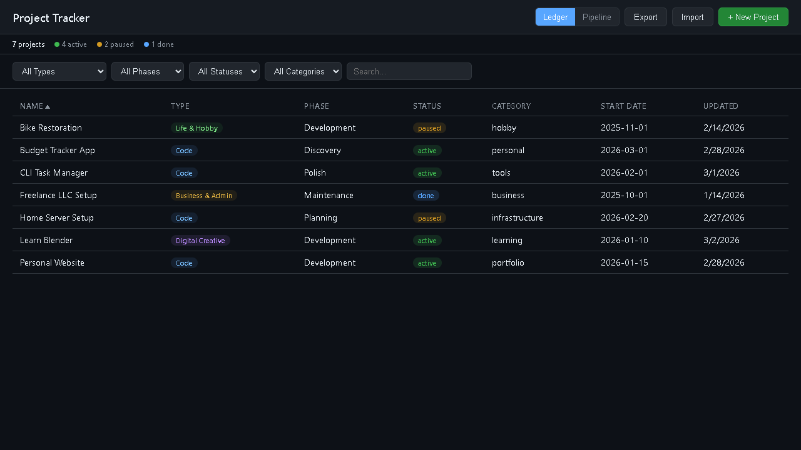

# Project Tracker

A personal project progress dashboard that runs on localhost. Designed as a **human-agent shared ledger** — both you and AI coding agents (Claude Code, Cursor, etc.) can view and update project statuses through a simple JSON file.




## Why This Exists

Most project trackers are either too heavy (Jira, Notion) or not accessible to AI agents. This one is:

- **A single JSON file** that agents can read/write directly — no database, no auth
- **A clean browser UI** for humans to visually manage projects
- **Zero config** — one command to start, works offline, no accounts

## Quick Start

```bash
git clone https://github.com/yourusername/project-tracker.git
cd project-tracker
npm install
npm start
# Opens http://localhost:7777
```

Or on Windows, double-click `start.bat`.

On first run, example projects are loaded automatically. Edit them or delete them and add your own.

## Features

- **Ledger view** — sortable table with type, phase, status, category, dates
- **Pipeline view** — kanban board with 5 columns (Discovery → Maintenance)
- **Filter bar** — filter by type, phase, status, category, or text search
- **Right-click context menu** — quickly change status, move phase, open folder, delete
- **Detail panel** — slide-out editor for all fields including freeform notes
- **Export / Import** — download or upload your projects as JSON
- **Dark theme** — easy on the eyes, GitHub-inspired design
- **Cross-platform** — works on Windows, macOS, and Linux

## Project Schema

Every project has these fields:

| Field | Type | Description |
|-------|------|-------------|
| `name` | string | Project name |
| `type` | enum | `code`, `creative`, `life`, `business` |
| `phase` | enum | `discovery`, `planning`, `development`, `polish`, `maintenance` |
| `status` | enum | `active`, `paused`, `done`, `cancelled`, `archived` |
| `category` | string | Free-form grouping (e.g. "portfolio", "work", "hobby") |
| `path` | string | Local folder path (enables "Open Folder" feature) |
| `description` | string | One-liner summary |
| `notes` | string | Freeform markdown notes |
| `tags` | array | Searchable labels |
| `startDate` | string | When work began |
| `endDate` | string | When completed (null if ongoing) |

### Types

| Key | Label | For |
|-----|-------|-----|
| `code` | Code | Repos, backend/frontend, CLI tools, deployments |
| `creative` | Digital Creative | Design, 3D, music, video, low-code sites |
| `life` | Life & Hobby | House projects, travel, hobbies, non-work |
| `business` | Business & Admin | Finance, legal, freelance, job search, admin |

### Pipeline Phases

```
Discovery → Planning → Development → Polish → Maintenance
```

### Statuses

| Status | Meaning |
|--------|---------|
| `active` | Currently being worked on |
| `paused` | On hold, intend to resume |
| `done` | Completed |
| `cancelled` | Abandoned |
| `archived` | Old, kept for reference |

## Agent Integration

The killer feature: AI agents can use this as their project ledger without the server running.

### Direct file access (always works)

```bash
# Read all projects
cat data/projects.json

# Or with jq
cat data/projects.json | jq '.projects[] | select(.status == "active")'
```

Agents can read the file, modify a project, and write it back. The server re-reads from disk on every request, so changes are picked up immediately.

### HTTP API (when server is running)

```bash
# List all projects
curl http://localhost:7777/api/projects

# Get one project
curl http://localhost:7777/api/projects/prj_abc123

# Create a project
curl -X POST http://localhost:7777/api/projects \
  -H "Content-Type: application/json" \
  -d '{"name": "New Project", "type": "code", "phase": "planning"}'

# Update a project
curl -X PUT http://localhost:7777/api/projects/prj_abc123 \
  -H "Content-Type: application/json" \
  -d '{"phase": "development", "status": "active"}'

# Delete a project
curl -X DELETE http://localhost:7777/api/projects/prj_abc123
```

### Claude Code / CLAUDE.md integration

Add this to your project's `CLAUDE.md` to make agents aware of the tracker:

```markdown
## Project Tracker
Central project ledger at `data/projects.json` in the project-tracker repo.
Update it when starting/finishing work or creating new repos.
Schema: type (code|creative|life|business), phase (discovery→maintenance), status (active|paused|done|cancelled|archived).
```

## File Structure

```
project-tracker/
  server.js              # Express server (~100 lines)
  package.json           # Only dependency: express
  start.bat              # Windows double-click launcher
  public/
    index.html           # Full frontend (single file, no build step)
  data/
    projects.json        # Your data (gitignored)
    projects.example.json # Example data (ships with repo)
```

## Tech Stack

- **Node.js + Express** — serves API + static files
- **Single HTML file** — vanilla HTML/CSS/JS, no frameworks, no build step
- **JSON file** — flat-file storage, human and machine readable
- **Port 7777**

## FAQ

**Is my data safe?**
Yes. Everything is stored in `data/projects.json` on your local disk. No cloud, no accounts, no telemetry. Browser cache, restarts, and reinstalls don't affect your data.

**Can I run it permanently?**
Yes. It uses ~25MB of RAM. Add `start.bat` to your Windows startup folder, or create a systemd service on Linux.

**Can I use it without the server?**
Yes. The JSON file is the source of truth. The server is just a convenience for the browser UI and API. Agents can always edit the file directly.

**Can I track hundreds of projects?**
Yes. JSON handles hundreds of projects without issue. The UI filters and sorts client-side.

## License

MIT
